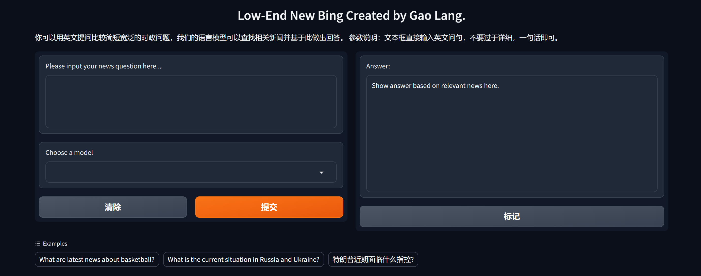

# <p align='center'>Low-End New Bing
<p align='center'>高朗 GaoLang </p><p align='center'> 🌐<a href="https://github.com/HeartyHaven/OLDBING" target="_blank">Github</a>

## 介绍 Introduction
Low-End New Bing 是一个问答模型，它能够实时获取与问题相关的关键信息，在全球范围内搜索相关新闻，并基于此给出正确的回答。
Low-End New Bing 是支持中英双语问答的模型，根据用户提出的问题，它能够返回相同语言的回答。
Low-End New Bing 内部集成了两个基本模型，一个是openai发行的chatgpt-3.5-turbo-0613，另外一个是在项目内部署的中文问答模型chatglm-6B。在客户端，用户可以自由选择两种模型，生成不同的回答。

Low-End New Bing is a question-and-answer model that takes key information related to a question in real time, searches for relevant news around the world, and gives the right answer based on this.
Low-End New Bing is a model that supports bilingual Q&A in both Chinese and English, and it can return answers in the same language based on the questions posed by the user.
Low-End New Bing integrates two basic models internally, one is the OpenAI-released chatgpt-3.5-turbo-0613, and the other is the Chinese question answering model chatglm-6B deployed in the project. On the client side, the user is free to choose between the two models and generate different answers.

## 软件依赖
```shell
pip install newsapi-python
pip install spacy==3.1.7 jieba
pip install https://github.com/explosion/spacy-models/releases/download/en_core_web_sm-3.1.0/en_core_web_sm-3.1.0.tar.gz
pip install protobuf==3.20.0 transformers==4.27.1 icetk cpm_kernels
pip install openai
```
## 代码调用
可以通过运行python文件：`cil.py`来开启客户端，打开返回的网址，能够看到如下界面：



用户可以在提示框中输入一个比较简短的时事政治问题，在下方的choose a model可以选择模型，右侧将会输出回答，下侧是几个可供参考的示例。

此外，用户还可以运行文件`gpt_test.py`在编译器测试模型gpt-3.5的问答性能。

## 文件说明
- `cli.py`：程序客户端
- `generate.py`：将chatglm-6b部署到本地，并且实现一个基本问答模型的构建。
- `getnews_en.py`：对问题进行关键词提取、翻译和新闻获取的算法设计。
- `gpt.py`：实现两个模型的新闻分析、回答功能的算法。
- `gpt_test.py`：测试gpt-3.5回答性能和检测请求异常的程序。
- `chatglm-6b`：chatglm-6b的配置文件和训练文件等，来自<a href='https://huggingface.co/THUDM/chatglm-6b/discussions'>huggingface</a>,由于权重参数文件过大，因此没有上传至项目。

## 复现方法
1. 将整个项目拷贝到本地。
1. 在项目目录中新建文件夹`THUDM`,并且将文件夹`chatglm-6b`剪切进去。
1. 运行`cli.py`，等待片刻会返回一个网址，点击进入即可开启客户端。
1. 输入问题，等待片刻即可输出答案，支持中英双语。该程序的使用需要外网加持，为了保证程序正常执行，不要使用英国IP。
1. 也可以直接运行`gpt_test.py`，根据提示输入问题,可以直接返回回答。


## 项目完成度
- 一个低配版的New Bing的构建；
- 支持中文输入输出；
- 通过修改prompt的方法，比如Chain-of-Thoughts和
In-context-learning，让ChatGPT能更好得得出答案；
- 使用自己部署的大模型替代ChatGPT （无论效果)；
- 实现简易客户端的搭建。
---
<p align=center>generated by gaolang from HUST</p># OLDBING
